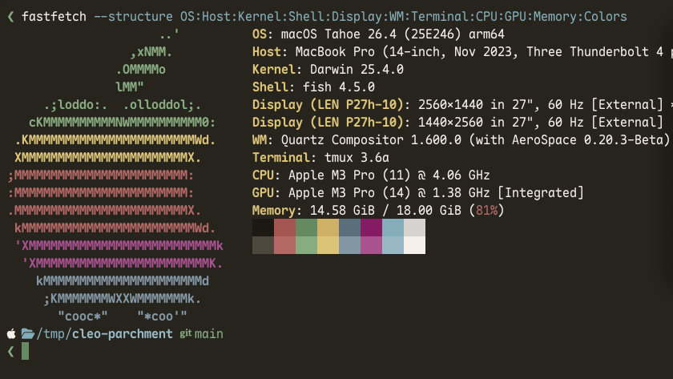
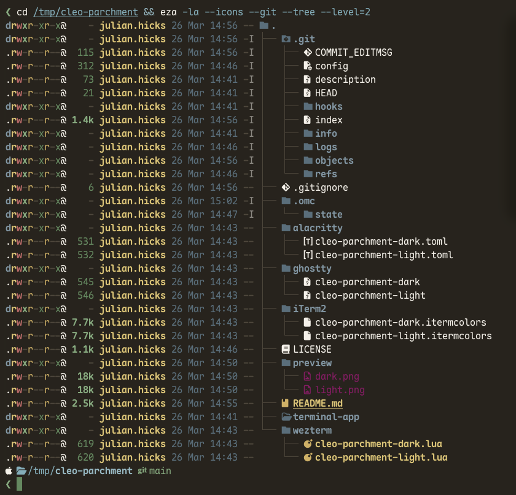
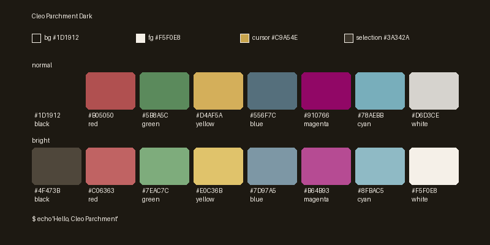
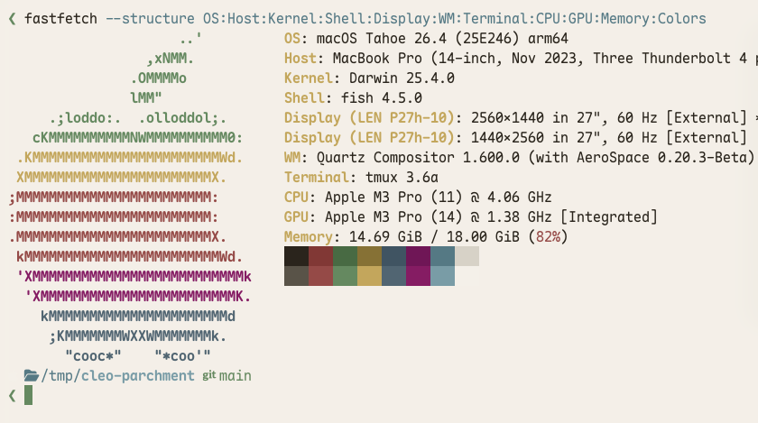
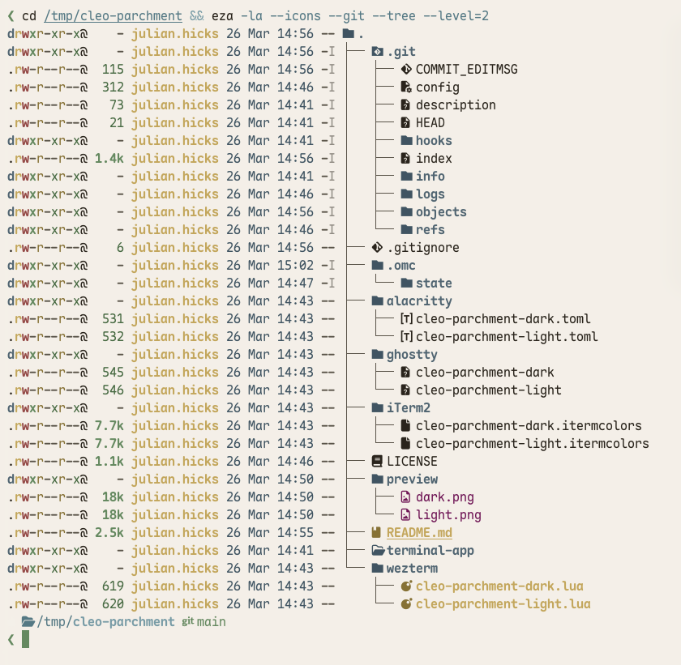
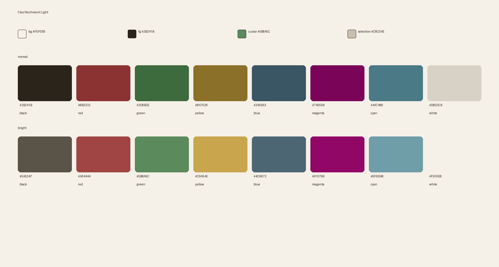

# Cleo Parchment

A warm, earthy terminal color scheme in light and dark variants. Designed for long sessions — easy on the eyes with green and gold accents on a parchment-toned base.

## Preview

### Dark





### Light





## Palette

### Dark
**Background:** `#1D1912` · **Foreground:** `#F5F0E8` · **Cursor:** `#C9A54E`

| | Normal | Bright |
|---|---|---|
| Black | `#1D1912` | `#4F473B` |
| Red | `#B05050` | `#C06363` |
| Green | `#5B8A5C` | `#7EAC7C` |
| Yellow | `#D4AF5A` | `#E0C36B` |
| Blue | `#556F7C` | `#7D97A5` |
| Magenta | `#910766` | `#B64B93` |
| Cyan | `#78AEBB` | `#8FBAC5` |
| White | `#D6D3CE` | `#F5F0E8` |

### Light
**Background:** `#F5F0E8` · **Foreground:** `#2B241B` · **Cursor:** `#5B8A5C`

| | Normal | Bright |
|---|---|---|
| Black | `#2B241B` | `#5A5347` |
| Red | `#8B3232` | `#A04444` |
| Green | `#3D6B3E` | `#5B8A5C` |
| Yellow | `#8A7028` | `#C9A54E` |
| Blue | `#3A5563` | `#4C6673` |
| Magenta | `#7A0558` | `#910766` |
| Cyan | `#4A7A86` | `#6F9DA8` |
| White | `#D8D2C6` | `#F5F0E8` |

## Installation

### Ghostty

```bash
mkdir -p ~/.config/ghostty/themes
cp ghostty/cleo-parchment-dark ~/.config/ghostty/themes/
cp ghostty/cleo-parchment-light ~/.config/ghostty/themes/
```

In `~/.config/ghostty/config`:

```ini
# Single theme
theme = cleo-parchment-dark

# Or auto-switch with system appearance
theme = light:cleo-parchment-light,dark:cleo-parchment-dark
```

### Alacritty

```bash
mkdir -p ~/.config/alacritty/themes
cp alacritty/cleo-parchment-dark.toml ~/.config/alacritty/themes/
```

```toml
import = ["~/.config/alacritty/themes/cleo-parchment-dark.toml"]
```

### WezTerm

```bash
mkdir -p ~/.config/wezterm/colors
cp wezterm/cleo-parchment-dark.lua ~/.config/wezterm/colors/
```

```lua
config.color_scheme_dirs = { wezterm.home_dir .. "/.config/wezterm/colors" }
config.color_scheme = "cleo-parchment-dark"
```

### iTerm2

Double-click the `.itermcolors` file to import, or go to Preferences > Profiles > Colors > Color Presets > Import.

## License

MIT
